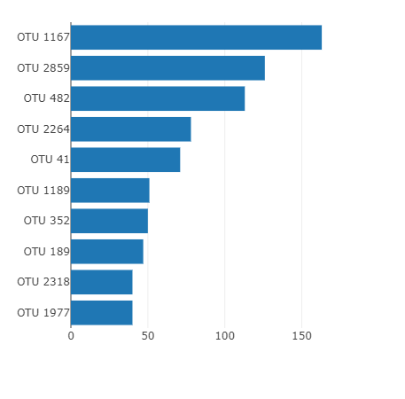
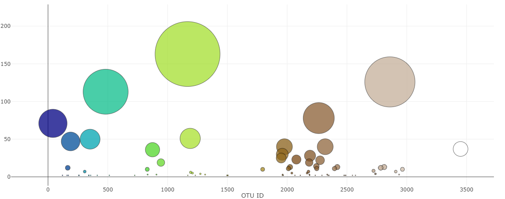
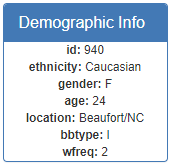
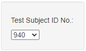
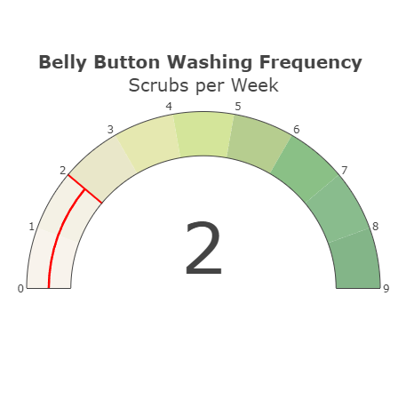
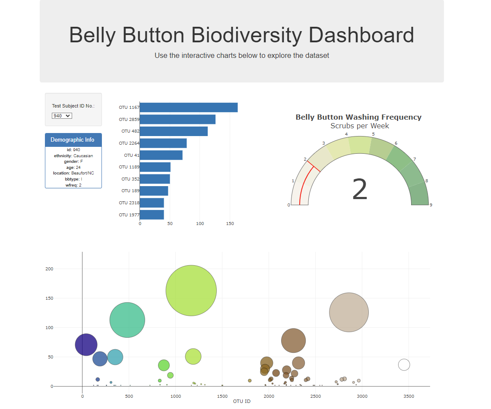

# belly-button-challenge

### Scenario

Using the [Belly Button Biodiversity](http://robdunnlab.com/projects/belly-button-biodiversity/) dataset:

- Build an interactive dashboard containing a minimum of three interactive visualisations
- When the user selects a different Sample ID, update all of the visuals within the dashboard accordingly

------

### Dashboard

Required steps:

- Use the D3 library to read in `samples.json` from the URL `https://2u-data-curriculum-team.s3.amazonaws.com/dataviz-classroom/v1.1/14-Interactive-Web-Visualizations/02-Homework/samples.json`.
- Create a horizontal bar chart with a dropdown menu to display the top 10 OTUs found in that individual.
    - Use `sample_values` as the values for the bar chart.
    - Use `otu_ids as the` labels for the bar chart.
    - Use `otu_labels` as the hovertext for the chart.

| Outcome: |
|----------|
|  |

------

- Create a bubble chart that displays each sample.
    - Use `otu_ids` for the x values.
    - Use `sample_values` for the y values.
    - Use `sample_values` for the marker size.
    - Use `otu_ids` for the marker colors.
    - Use `otu_labels` for the text values.

| Outcome: |
|----------|
|  |

------

- Display the sample metadata, i.e., an individual's demographic information.
- Display each key-value pair from the metadata JSON object somewhere on the page.

| Outcome: |
|----------|
|  |

-------

- Update all the plots when a new sample is selected.
    - Using the D3 library during the `init` function of the code, the dropdown menu is populated with all the Sample ID numbers from the JSON file
    - When selecting a new ID from the dropdown, all visuals are updated

| Outcome: |
|----------|
|  |

------

- There was an optional assignment to include a guage chart within the dashboard
    - Although I wasn't able to fully replicate the example provided, this gave me valuable insight into the capabilities of the Plotly library

| Outcome: |
|----------|
|  |

-------

- Finally, the dashboard required deploying to GitHub pages for users to utilize
    - The link is: [https://rjbarker.github.io/belly-button-challenge/](https://rjbarker.github.io/belly-button-challenge/)

| Dashboard Outcome: |
|----------|
|  |

--------

## References

| Reference Name | Description |
|----------------|-------------|
| [Plotly Library](https://plotly.com/javascript/) | JavaScript library which enables the creation of Interactive Visuals with low code |
| [D3 Library](https://d3js.org/) | D3 by Observable. Used to build visuals and manipulate HTML/CSS elements |
| Hulcr, J. et al. (2012)  A Jungle in There: Bacteria in Belly Buttons are Highly Diverse, but Predictable. | Retrieved from: [http://robdunnlab.com/projects/belly-button-biodiversity/results-and-data/](http://robdunnlab.com/projects/belly-button-biodiversity/results-and-data/)|
| edX Boot Camps LLC | Putting the assignment together and supplying of the starter files and like to the dataset |

